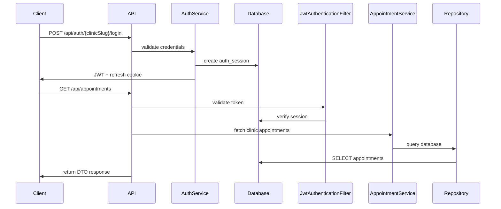

# ClinicFlow

## Overview

ClinicFlow started as a scheduling tool for a physical therapy clinic where I worked. The goal was to replace manual scheduling boards with a simple API-driven system that could power both administrative tools and display boards for therapists.

ClinicFlow is a scheduling and clinic operations system for physical therapy clinics. It helps clinics manage appointments, therapists, patients, and treatment cases in one backend, while keeping each clinic's data separate.

This repository contains:

- A Spring Boot backend in `backend/`
- A React/Vite frontend client in `client/clinicflow-ui/`

The backend handles:

- appointment scheduling
- therapist management
- patient and case tracking
- multi-clinic tenancy
- secure authentication with JWT and server-side sessions

The main focus of the project is the Spring Boot backend. The frontend in this repo is a client for that API.

## Design Goals

- Keep clinic data isolated so each tenant only accesses its own operational records
- Use JWT authentication with server-side session validation so tokens can be revoked safely
- Maintain a straightforward layered architecture that is easy to extend and test
- Support both administrative workflows and schedule display board use cases from the same backend
- Keep the API practical for day-to-day clinic operations rather than over-abstracting domain logic

## Features

- Multi-tenant clinic architecture with clinic-scoped data access
- Appointment scheduling with therapist conflict checks
- Therapist management
- Patient records with search and pagination
- Case tracking tied to patients and body regions
- JWT authentication with access and refresh tokens
- Server-side session management with revocation support
- Role-based access control for `ADMIN` and `DISPLAY` users
- REST-style API for authentication and clinic operations
- Database schema migrations managed with Flyway
- Pagination and filtering for appointments, patients, therapists, and body regions
- Request validation and centralized error handling
- Demo clinic protections for read-only seeded environments

## Tech Stack

### Backend

- Java 17
- Spring Boot
- Spring Security
- Spring Data JPA
- Hibernate
- MapStruct
- Lombok

### Database

- PostgreSQL
- Flyway

### Authentication

- JWT access tokens
- Refresh tokens in HTTP-only cookies
- Server-side session tracking in `auth_sessions`

### Build Tools

- Maven
- Maven Wrapper

### Testing

- JUnit 5
- Spring Boot Test
- MockMvc
- H2 for test execution

### Frontend

- React
- TypeScript
- Vite
- Material UI

## Architecture

ClinicFlow uses a standard layered Spring Boot structure. HTTP handling, business logic, persistence, and security are split into separate parts of the codebase.

### Layers

- Controllers expose endpoints under `/api/**`
- Services contain business logic, validation, and clinic-scoped rules
- Repositories handle persistence with Spring Data JPA and custom queries
- DTOs and mappers keep API payloads separate from JPA entities
- Security filters and auth services handle JWT parsing and session checks
- Configuration classes define security, CORS, password encoding, JWT settings, and WebSocket support



### Request Flow

1. A client authenticates against a clinic-specific login endpoint such as `POST /api/auth/{clinicSlug}/login`.
2. The backend validates the credentials, resolves the clinic, creates an auth session, and returns an access token plus a refresh token cookie.
3. Subsequent requests include a Bearer access token.
4. `JwtAuthenticationFilter` parses the token, checks expiration and session state, and loads the authenticated principal into the Spring Security context.
5. Controllers delegate work to services.
6. Services read the current user's `clinicId` from the authenticated principal and only operate on records for that clinic.
7. Repositories execute JPA and custom SQL queries against PostgreSQL.
8. Responses are returned as DTOs, and validation or domain errors are translated into HTTP responses by the global exception handler.

## Project Structure

The backend code lives under `backend/src/main/java/com/clinicflow/clinic_flow`.

- `appointment/` - appointment entities, DTOs, repository, mapper, controller, and service code
- `auth/` - JWT generation/parsing, login/refresh/logout flows, filters, and auth DTOs
- `auth_sessions/` - persistent auth sessions and revocation logic
- `body_region/` - body region CRUD endpoints and related mapping
- `cases/` - case management tied to patients and body regions
- `clinics/` - clinic entity, repository, and clinic context helpers
- `config/` - Spring Security, JWT, CORS, password encoding, and WebSocket configuration
- `exception/` - custom exceptions and centralized error handling
- `patient/` - patient CRUD, search, pagination, and mapping
- `therapist/` - therapist CRUD and search
- `users/` - clinic users, roles, and current-user context services
- `common/` - shared response models such as paginated response wrappers

Flyway migrations are stored in:

- `backend/src/main/resources/db/migration`

The frontend client is located in:

- `client/clinicflow-ui`

## Database Design

ClinicFlow uses PostgreSQL, and schema changes are managed with Flyway migrations. Multi-clinic tenancy is implemented by associating the main operational tables with a `clinic_id`.

### Core Entities

- `clinics` - clinic tenants, slug-based identification, and demo clinic flags
- `users` - clinic-scoped users with roles such as `ADMIN` and `DISPLAY`
- `patients` - patient records and clinic ownership
- `therapists` - clinic therapists and therapist type classifications
- `cases` - patient treatment cases connected to body regions
- `appointments` - scheduled visits linked to therapists, cases, status, and type
- `body_regions` - shared injury/treatment region catalog
- `auth_sessions` - persistent session state used to validate and revoke JWT-backed access

### Tenancy Model

- The authenticated principal carries `clinicId`
- Services use the current clinic context to scope reads and writes
- Repositories expose clinic-aware queries such as `findByIdAndClinicId(...)`
- Clinic-specific uniqueness constraints protect tenant boundaries

### Migrations

Flyway migration files are versioned as SQL scripts such as:

```sql
V0__add_new_table.sql
```

Notable migrations in this repository add clinic tenancy, user accounts, auth sessions, and demo seed data.

### Demo Sandbox

- Clinic slug: `demo`
- Seeded users: `demo_admin` and `demo_display`
- The demo clinic is read-only after login, so seeded records can be explored safely without allowing writes
- Seeded records use a Resident Evil protagonist/support cast across patients, therapists, cases, and appointments

## Multi-Clinic Tenancy

Tenant isolation is enforced explicitly in the data model and application layer.

- Operational tables such as `users`, `patients`, `therapists`, `cases`, `appointments`, and `auth_sessions` carry a `clinic_id`
- The authenticated principal includes `clinicId`, which is read from the JWT and stored in the Spring Security context
- Repository methods use clinic-aware lookups such as `findByIdAndClinicId(...)` to avoid cross-clinic access
- Services enforce clinic scope before reads and writes, using the current authenticated clinic rather than trusting client input
- Authentication itself is clinic-aware because login is performed against a clinic slug

## Setup and Installation

### Prerequisites

- Java 17
- PostgreSQL
- Maven 3.9+ or use the included Maven Wrapper

### 1. Clone the repository

```bash
git clone <repo-url>
cd clinic-flow
```

### 2. Configure environment variables

The backend reads configuration from environment variables defined in `backend/src/main/resources/application.yaml`.

Required variables:

```bash
export DB_URL=jdbc:postgresql://localhost:5432/clinicflow
export DB_USER=postgres
export DB_PASSWORD=postgres
export JWT_SECRET=change-me-to-a-long-random-secret
```

Notes:

- `DB_USER` is the variable name expected by the backend
- `JWT_SECRET` should be a strong secret in non-local environments

### 3. Run database migrations

From the backend directory:

```bash
cd backend
./mvnw flyway:migrate
```

### 4. Start the application

```bash
cd backend
./mvnw spring-boot:run
```

The backend starts on:

```text
http://localhost:8080
```

### 5. Optional: run the frontend client

```bash
cd client/clinicflow-ui
npm install
npm run dev
```

The default frontend development server runs on:

```text
http://localhost:5173
```

## API Overview

The API is exposed under `/api` and secured with JWT-based authentication. Most endpoints are clinic-scoped through the authenticated principal and the service layer.

### Authentication

- `POST /api/auth/{clinicSlug}/login`
- `POST /api/auth/refresh`
- `POST /api/auth/logout`
- `POST /api/auth/validate`
- `GET /api/auth/me`

### Appointments

- `GET /api/appointments`
- `GET /api/appointments/{id}`
- `GET /api/appointments/date`
- `POST /api/appointments`
- `PATCH /api/appointments/{id}`
- `DELETE /api/appointments/{id}`

### Patients

- `GET /api/patients`
- `GET /api/patients/{id}`
- `GET /api/patients/search?q=...`
- `POST /api/patients`
- `PATCH /api/patients/{id}`
- `DELETE /api/patients/{id}`

### Therapists

- `GET /api/therapists`
- `GET /api/therapists/{id}`
- `POST /api/therapists`
- `PATCH /api/therapists/{id}`
- `DELETE /api/therapists/{id}`

### Cases

- `GET /api/cases`
- `GET /api/cases/{id}`
- `GET /api/cases/patient/{id}`
- `POST /api/cases`
- `PATCH /api/cases/{id}`

### Users and Admin

- `GET /api/users`
- `GET /api/users/{userId}`
- `POST /api/users`
- `PATCH /api/users/{id}`
- `GET /api/admin`

### Example Query Patterns

- `GET /api/appointments?page=0&size=20`
- `GET /api/appointments?date=2026-04-05`
- `GET /api/appointments?caseId=42`
- `GET /api/therapists?search=taylor`

### Example Response

```json
[
  {
    "aptId": 5,
    "scheduledAt": "2026-02-23 10:00",
    "caseId": 5,
    "firstName": "Leon",
    "lastName": "Kennedy",
    "therapistId": 2,
    "therapistName": "Ada Wong",
    "therapistType": "OCCUPATIONAL_THERAPIST",
    "bodyRegionDisplayName": "hip",
    "status": "SCHEDULED"
  }
]
```

## Security

ClinicFlow uses JWTs for request authentication, but it also keeps server-side session state so tokens can be checked against the database.

- Access tokens are issued as JWTs and sent in the `Authorization: Bearer <token>` header
- Refresh tokens are stored in HTTP-only cookies and exchanged through `/api/auth/refresh`
- Every login creates an `auth_sessions` record in the database
- Access is granted only if the JWT is valid and the backing session is still active
- Logout and refresh flows revoke old sessions
- Spring Security enforces role-based access control on protected routes

### Roles

- `ADMIN` - full access to appointments, patients, therapists, cases, users, and clinic administration
- `DISPLAY` - read access to schedule display views such as `GET /api/appointments/date`

### Tenant Isolation

- Users authenticate against a clinic slug
- JWT claims include clinic context
- Service and repository methods scope operations by `clinicId`
- Demo clinic records can be protected from writes through `ClinicContextService`

## Development

### Run tests

Backend tests run with H2 and Spring Boot test support:

```bash
cd backend
./mvnw test
```

### Create a new migration

Add a new Flyway SQL migration under:

```text
backend/src/main/resources/db/migration
```

Example:

```sql
V24__add_new_table.sql
```

### Local development notes

- The backend expects PostgreSQL in normal runtime environments
- Tests use H2 with Flyway disabled in `backend/src/test/resources/application.yaml`
- CORS is configured for local frontend development on port `5173`

## Deployment

ClinicFlow can be deployed in several common ways:

- Docker containers for packaging the Spring Boot application
- AWS EC2 for a VM-based deployment
- Nginx as a reverse proxy in front of the application

### Deployment considerations

- Provide secrets through environment variables, not committed configuration files
- Use a production-grade PostgreSQL instance
- Enable secure cookies and HTTPS in production environments
- Set a strong `JWT_SECRET`
- Run Flyway migrations as part of the deployment pipeline

## Future Improvements

- Expand live schedule boards with richer WebSocket event publishing
- Add deeper therapist availability and working-hours constraints
- Improve appointment conflict visualization and scheduling insights
- Introduce analytics and clinic performance reporting
- Add audit logging for sensitive record and authentication events
- Extend API documentation with OpenAPI or Swagger
- Add container orchestration and infrastructure-as-code examples
