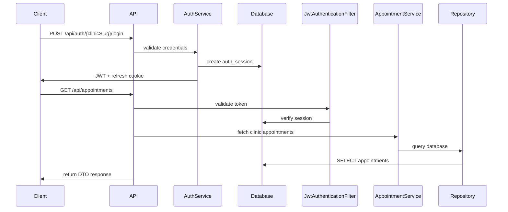

# ClinicFlow

## Overview

ClinicFlow started as a scheduling tool for a physical therapy clinic where I worked. The goal was to replace manual scheduling boards with a simple API-driven system that could power both administrative tools and display boards for therapists.

ClinicFlow is a multi-tenant scheduling backend for physical therapy clinics. It manages appointments, therapists, patients, and cases, with clinic-scoped data access and JWT authentication backed by server-side session validation.

This repo includes:

- `backend/` - Spring Boot API
- `client/clinicflow-ui/` - React/Vite client

## Deployment

Current demo deployment:

- Live demo : [https://clinic-flow-4hei.onrender.com](https://clinic-flow-4hei.onrender.com)
- EC2 runs PostgreSQL and the backend Docker container
- Caddy terminates TLS for `clinic-flow-api.duckdns.org`
- Render hosts the frontend static site

### Demo Sandbox

- Seeded users: `demo_admin` and `demo_display`
- The demo clinic is read-only after login, so seeded records can be explored safely without allowing writes


## Design Goals

- Keep clinic data isolated by tenant
- Use revocable JWT-based authentication
- Keep the backend easy to extend with a standard layered structure
- Support both admin workflows and schedule display boards

## Features

- Multi-clinic tenancy
- Appointment scheduling and conflict checks
- Therapist, patient, and case management
- JWT access tokens with refresh cookies
- Server-side session tracking and revocation
- Role-based access control (`ADMIN`, `DISPLAY`)
- Flyway database migrations
- Pagination, filtering, and request validation

## Tech Stack

- Java 17
- Spring Boot
- Spring Security
- Spring Data JPA / Hibernate
- PostgreSQL
- Flyway
- Maven
- JUnit / MockMvc

## Architecture

ClinicFlow follows a typical Spring Boot layered architecture:

- Controllers expose `/api/**` endpoints
- Services contain business logic and clinic scoping
- Repositories handle persistence
- DTOs and mappers separate API payloads from entities
- Security filters validate JWTs and active sessions



## Data Model

Core tables:

- `clinics`
- `users`
- `patients`
- `therapists`
- `cases`
- `appointments`
- `body_regions`
- `auth_sessions`

Flyway migrations live in `backend/src/main/resources/db/migration`.

## Multi-Clinic Tenancy

Tenant isolation is enforced in both the schema and application layer:

- Operational tables include `clinic_id`
- The authenticated principal carries `clinicId`
- Repository methods use clinic-aware lookups such as `findByIdAndClinicId(...)`
- Services scope reads and writes to the current clinic
- Login is clinic-aware through `POST /api/auth/{clinicSlug}/login`

## Setup

### Prerequisites

- Java 17
- PostgreSQL

### Environment Variables

```bash
export DB_URL=jdbc:postgresql://localhost:5432/clinicflow
export DB_USER=postgres
export DB_PASSWORD=postgres
export JWT_SECRET=change-me-to-a-long-random-secret
```

### Run the Backend

```bash
git clone <repo-url>
cd clinic-flow/backend
./mvnw flyway:migrate
./mvnw spring-boot:run
```

Backend URL:

```text
http://localhost:8080
```

### Optional: Run the Frontend

```bash
cd client/clinicflow-ui
npm install
npm run dev
```

## API Overview

Example endpoints:

- `POST /api/auth/{clinicSlug}/login`
- `POST /api/auth/refresh`
- `POST /api/auth/logout`
- `GET /api/appointments`
- `GET /api/appointments/date`
- `POST /api/patients`
- `GET /api/therapists`

Example response:

```json
[
  {
    "aptId": 5,
    "scheduledAt": "2026-02-23 10:00",
    "caseId": 5,
    "firstName": "Leon",
    "lastName": "Kennedy",
    "therapistId": 2,
    "therapistName": "Ada Wong",
    "therapistType": "OCCUPATIONAL_THERAPIST",
    "bodyRegionDisplayName": "hip",
    "status": "SCHEDULED"
  }
]
```

## Security

- Access tokens are sent as Bearer JWTs
- Refresh tokens are stored in HTTP-only cookies
- Each login creates an `auth_sessions` record
- Requests are accepted only if the JWT is valid and the session is active
- `ADMIN` users manage clinic data
- `DISPLAY` users can access display-oriented schedule views

## Development

Run tests:

```bash
cd backend
./mvnw test
```
